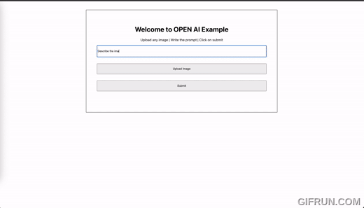

### REACT JS OPEN AI IMAGE ANALYSIS

1. Upload any Image.
2. Enter the prompt.
3. Generate Results.

### Add Open AI API key before running the application.

1.  Get your Open AI API Key from https://platform.openai.com/api-keys.
2.  Create .env file inside the root folder (ame place where you have your package.json).
3.  Add line REACT_APP_OPENAI_KEY=<Your API Key here> (Replace <Your API Key here> with your open ai api key).
4.  Note: Make sure you have GPT 4 subscription, this application will not run for GPT 3 as it uses image analysis.

### TO Run the application

1. Naviagte to Project folder.
2. `npm install`
3. `npm start`
